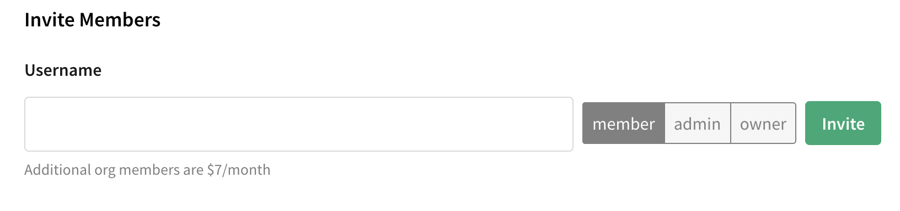
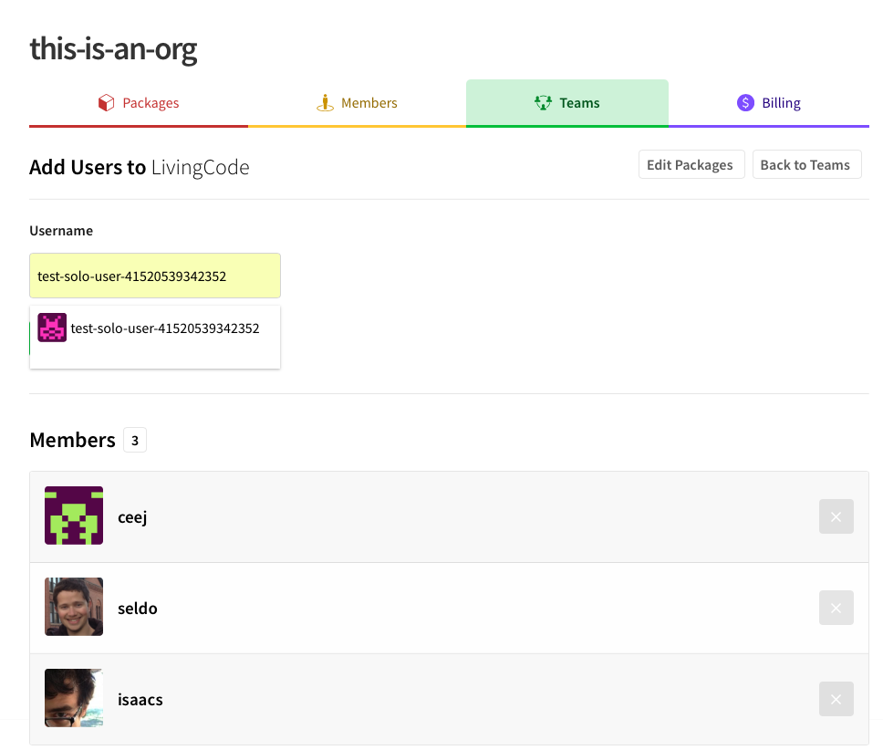
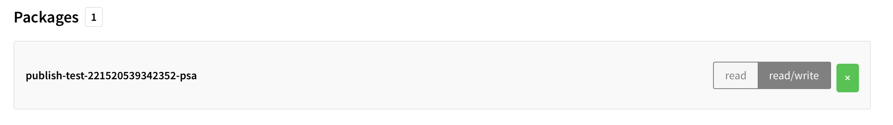

# npm Orgs

_This is a top-level introduction to Orgs. Skip ahead if you are ready to [get started](https://www.npmjs.com/docs/orgs/getting-started.html)._

npm created Orgs to make it easier to manage packages as well as teams of developers. 

Read this chapter to get some ideas about how you might use npm Orgs. You can find detailed instructions in the later chapters of this book.  

## Organizing Packages

When you create an Organization, you are granted an Organization _scope_, a unique namespace for packages. The Organization scope will match the name that you give your Organiation. For example, if your organization is called "the best", you would register
as "the-best" and get a scope, `@the-best`. With your scope, you can name your packages whatever you want (according to our guidelines, which are similar to the general package name [guidelines](https://docs.npmjs.com/files/package.json#name). 

Scopes make it easier to:

- Maintain a fork of a package, e.g. `@the-best/request`.
- Avoid name disputes with popular names, e.g. `@the-best/cat`.
- Find packages within your organization.

### Can I use my npm Org to manage packages that don't use my Org's scope? 
 
Yes. While you are granted a scope by default when registering as an Org, using the scope is optional. In fact, you can use Orgs to manage unscoped
packages, or even packages under a different scope, such as a user scope,
e.g. `@isaacs/hello`, where `isaacs` is an npm user.

## Organizing People and Package Access

A key benefit of npm Orgs is that it makes it easier, and in some cases,
simply *possible*, to manage access and visibility of packages across
a large team of contributors.

To get the biggest benefit from Orgs:

1. Organize your developers into teams. 
2. Grant team permissions (read/write) to packages you govern, which then
cascades to all Members of that team. 

This way, certain teams can develop a package (write access) while other teams can use the pacakge but can't modify it (read access). You can set the access that makes sense for your project, for all of the packages that the Organization governs, public unscoped packages and public/private scoped packages 
alike. 

### Adding Members to an Org

Working with teams, adding packages, and setting access levels is easy from npmjs.com.

To add npm users to your Org, just type their npm username, and select an access level:

### Adding Org Members to a Team
To add existing Org members to a team, just start typing their name. A drop-down menu will appear. 

### Setting Team Package Access

To manage package and package access, click `read` or `read/write`: 

## What is the cost?

Orgs are **free** if your Organization only uses public packages.

If your Organization needs to also publish and install **private packages**, an Org will cost you $7/month/user, for each user, including yourself. 

It's easy to [upgrade](https://www.npmjs.com/docs/orgs/upgrading-and-downgrading.html) as your needs change. 

For detailed cost information, see the [pricing](https://www.npmjs.com/pricing) page. 
