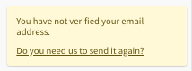
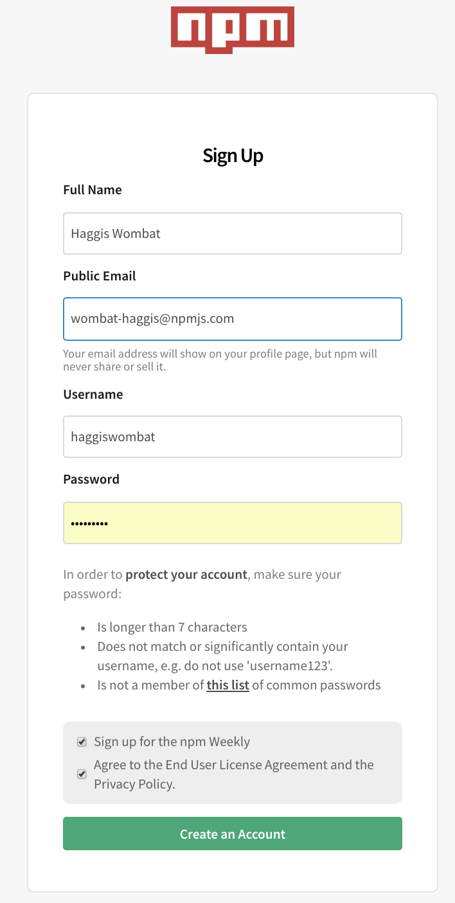
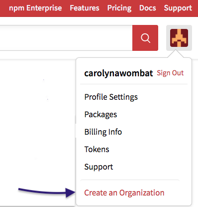

Click `Create an Organization` from the menu.
 
  

|  | I am text to the right |

| - | - |
|---|---|
| I am text to the left  |  |
|  | I am text to the right |

| - | - |
|---|---|
|  |  |
|  |   |

| I am text to left | | I am text to the right |

              | 

****

https://stackoverflow.com/questions/255170/markdown-and-image-alignment

# Getting Started

npm Organizations make it easy to collaborate with other developers. This page will teach you how to navigate npm's web interface to create an Organization. 

This chapter explains how to sign in to npm, and how to get started using npm Orgs. 

## How to sign up for npm from the web

### 1. Sign up for an npm Account
1.  If you don't have an npm user account sign up for one [here][1]. The picture shows a completed sign-up screen.

When you have filled in your information, click `Create an Account`. 

2. Open the email you used to log in, to validate your account. If you need to resend the email, click the message:

 
 
 
Click `Create an Organization` from the menu.
 
  

|  | I am text to the right |

| I am text to left | | I am text to the right |

## 2. Create an Organization

* Once you are logged in, 
To create an Organization, y
(EXPLAIN HOW TO SIGN UP ETC)

If you are already logged in, just go to 
[the create website]. Skip the next section. 

Once you are logged in, click on the avatar or photo you used for your profile. 

Your profile page will appear. Find the plus button and click. 

#FIGURE B ASK JERRY ABOUT THIS!

[token website hideous colors](https://docs.npmjs.com/getting-started/working_with_tokens) 

From there, you
should see three (3) links under the "Your Account" heading. Click
"create an organization".

If you are already logged in, you can also go directly to
[the token website][https://www.npmjs.com/org/create](https://www.npmjs.com/org/create).

## 3. Name Your Organization and Choose Your Plan

Give your Organization a name! Choose wisely, as changing your Organization
is complicated and requires [contacting npm Support]. 
[Learn more about renaming and/or deleting your Organization].

*Would you like to convert your current user account to an Organization?
Want to use your current user scope as an Organization scope?
[Learn more about migrating a user account].*

Once you've named your Organization, you'll need to choose a plan.
Currently, npm offers 2 plans:

  - **Free**: public packages only.
  - **Paid**: install and publish **private packages** ($7/user/month).

For example, if you have 3 users, an Organization that only needs public 
packages will be entirely free. However, if your Organization needs to
install and publish **private packages**, it will cost $21/month 
($7/month*3 users).

**You can change your plan any time through the billing panel.** For
more information on the features of each plan, visit our [pricing page].

Once you have chosen your plan, click the big red "Create an Organization"
button.

## 4. Enter Payment Information (paid Orgs only)

If you chose an Organization with access to private packages, clicking the
big red "Create an Organization" button will bring up a Stripe Payments
prompt. Enter the email address you'd like associated with billing (this
does *not* have to match the owner's email), as well as billing address
and credit card information.

**You can change your billing info at anytime through your Organization's
billing page.**

Your credit card will be immediately billed $7 for a single user, the
account of the person creating the Organization. 

## 5. Add Members to your Organization

Now that you've created your Organization, you are given the ability to add
members. You can add members to your Organization at any time, so feel free
to skip this step if you aren't ready to add users yet.

The user who created the Organization is:

- Automatically assigned the **role** of **Owner**. 
  [Learn more about Roles and Privileges].
- Automatically added to a **team** called **Developers**. 
  [Learn more about the Developers team].

To add users to your Organization, enter their npm username into the text
input and click the red button that says "Invite". If you chose an
Organization with private package access, every user will add an 
additional $7/month to your bill.

**When you add a member to your Organization they are immediately added. They
do not receive an email, so please let your new members know that you have added
them.**

All the users you add from this interface are:

- Automatically assigned the **role** of **Member**
  [Learn more about Roles and Privileges].
- Automatically added to a **team** called **Developers**
  [Learn more about the Developers Team].

If the person you would like to add to your Organization does not have an
npm username, they'll need to create an npm user account. You can send them
[this link][1] to sign up.

