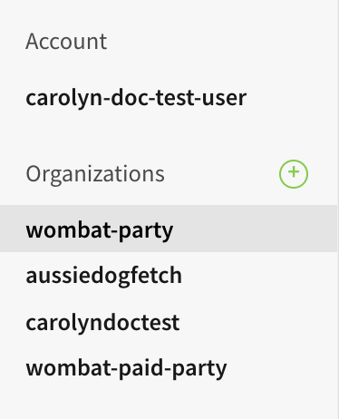
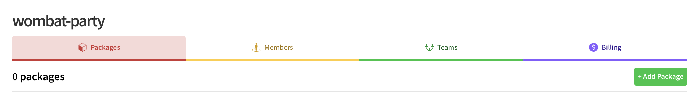
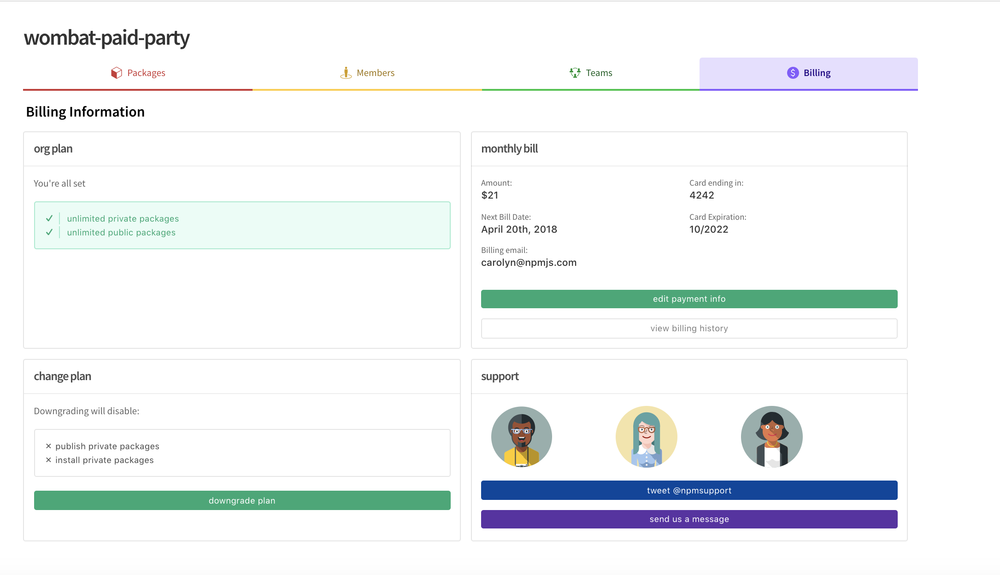

# Managing Billing

This page will explain how npm bills for npm Organizations and will teach
you how to manage your billing informaton.

You will need to have the Owner role to perform this work. For more information on
roles, check out the [Roles and Privileges doc].

<hr/>

## How npm Bills for Organizations

Billing for Organizations is based on whether you have a private packages plan and
how many members your Organization has.

### Free Organizations

If you have an Organization that does not have a private packages plan, otherwise
known as a "Free Org", your Organization is free for any number of users.

If you are interested in adding a private packages plan, you can upgrade your
Organization. ([Learn more about upgrading and downgrading your Org]).

### Organizations with Private Packages

If you have an Organization with a private packages plan, your Organization will cost
you seven (7) dollars a month per user. **The $7 charge is a flat fee for any member
of the Organization regardless of their Package Access.**
([Learn more about managing members]).

You can calculate your monthly bill as follows:

```
number of users * 7
```

Newly added members to an Organization are always billed during the next billing
cycle. Let's look at an example:

- A new Organization is created on March 22.
- The current bill is $7 as there is only one user: the Owner/creator.
- The Owner waits a few days and decides to add two more Members.

In this situation, billing would happen as follows:

- On March 22nd, the Organization will be billed $7.
- On April 22nd, the Organization will be billed for $21.
  *(assuming only the two members were added before March 22nd)*

You can always view your upcoming bill and billing history on the payment info
tab for your Organization, at `https://www.npmjs.com/scope/<org_name>/billing`.

If you ever have a question about your bill, you should [contact npm support].

If you would like to stop paying for your Organization, you can downgrade your
Organization to a free Organization. If you do this, you will lose the ability
to install and publish private packages at the end of your last paid billing
cycle. ([Learn more about upgrading and downgrading your Org])

## Updating Your Billing Information


1. To manage your Organization's billing, open the Avatar menu, then click your username. 

2. Click the Organizations tab. 

3.  Choose the Organization you wish to review from the left menu. 

<div style="text-align: center;"></div>

3. Click the Billing tab to see current billing information.

<div style="text-align: center;"></div>

4. The Org's billing information appears. 

<div style="text-align: center;"></div>

From this tab, you can find all the information you need to work with billing. For more screen shots about how to enter credit card information, please see the next chapter, _Upgrading and Downgrading_.

#### Notes

- **Your Organization's billing page is different from your personal billing page. They look very similar! Make sure that you are on the correct page before you change any information.**

- **Worried about an expired credit card?** If your card expires, your access will not be immediately revoked. There is a grace period that allows you to update your information.

[Roles and Privileges doc]: roles-and-privileges.md
[Learn more about upgrading and downgrading your Org]: upgrading-and-downgrading.md
[Learn more about managing members]: managing-members.md
[contact npm support]: https://www.npmjs.com/support
[Stripe]: https://stripe.com/
