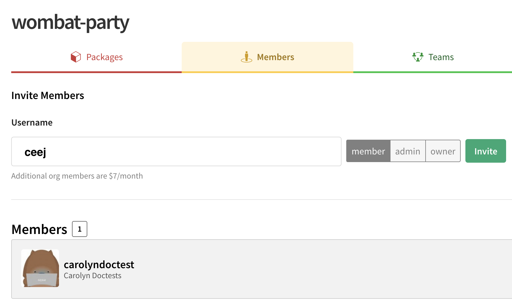
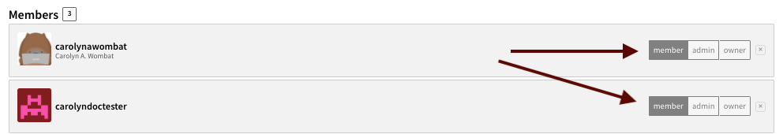
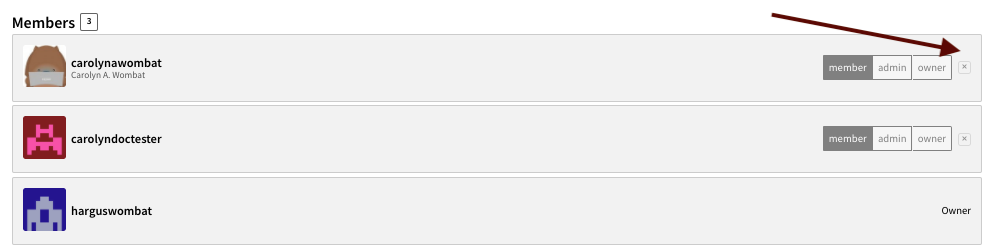

# Managing Members

This page will explain how to add, remove, and manage **members** of your organizations. It will also explain how to manage the **roles** of those members.

You will need to have the **owner** role to perform this work. For more
information on **roles**, check out the [Roles and Privileges doc].

To manage the members of your organization, navigate to your organization's landing page. You can find it at `https://www.npmjs.com/org/<org_name>`.

Once you are on the landing page, click the `Members` tab. Or, you can just point your browser at 
`https://www.npmjs.com/org/<org_name>/members`.

## Adding Members

To add a member:

1.  Make sure the new member has an npm user account. If they don't, have them
  [signup here].  
2. Enter the new member's npm username.

 

### Set the role

1. Select the **role** you would like the new member to have from one of the 3 buttons. 
  ([Learn more about Roles and Privileges]).
2. Click the green `Invite` button.

### Notes:

- **_Adding an npm user as a Member to an Organization does not send that
  user an email. You need to inform the member that you have 
  added them!_**
- All npm Org members are automatically added to the Developers team 
([Learn more about the Developers team]).
- Explore how you can use multiple teams to manage package access for members. ([Learn more about managing teams]). 

## Changing a Member's Role

To change a **member's role**:

1. Locate the **member** in the list. 
2. Click `member`, `admin`, or `owner` depending on the level that you want to assign.

## Deleting a Member

To delete a Member:

1. Locate the **member** in the list of Members.
2. Click the X at the end of the row matching the member you wish to delete.

If your delete request was successful, the member will no longer be listed.

### Notes:

- Removing a member from an organization does *not* send that user an email. You
  should tell this user that they are no longer a Member of your Organization.

[Learn more about Roles and Privileges]: roles-and-privileges.md
[Roles and Privileges doc]: roles-and-privileges.md 
[signup here]: https://www.npmjs.com/signup
[Learn more about the Developers Team]: the-developers-team.md 
[Learn more about Managing Teams]: managing-teams.md

