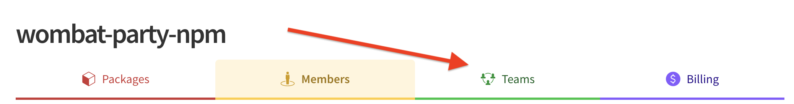
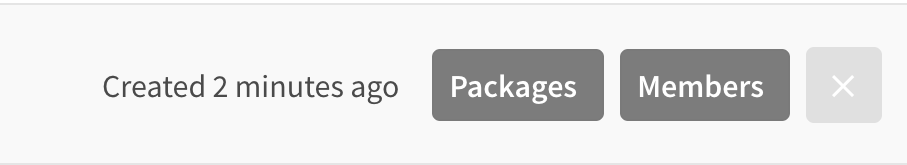
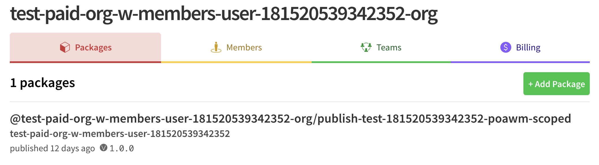
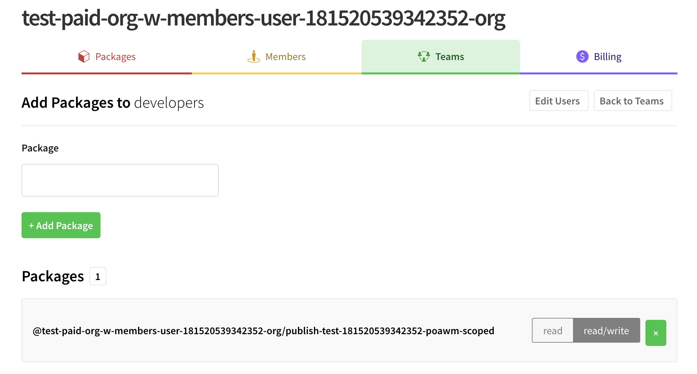

# Managing Package Access

The key to managing package access in an Organization is teams.
**Teams are sets of Organization members that have defined privileges
for a set of packages that are controlled by the Organization**.
This page will teach you how to create and manage the
membership of your Organization's team from the web interface.

If you would like to manage the package access of your team from
the npm command line interface (CLI), you can use:

```
npm access
```

Learn more about `npm access` [here][2].

If you are looking for how to manage a team's membership, check
out [this doc][1].

You will need to have the **Owner** or **Admin** role to perform this
work. For more information on **roles**, check out the
[Roles and Privileges doc].

<hr/>

To manage the package access of a team:

1. Using the Avatar menu, click your user name to display your home page.

2. Click `Organizations` on the tab that appears.

     <div style="text-align: center;"></div>

3. Choose teams from the top arrow:

     <div style="text-align: center;"></div>

4. Click the gray Packages menu for the appropriate team.

     <div style="text-align: center;"></div>

5. From this list, click Add Package to add a package:

     <div style="text-align: center;"></div>

## Controlling Access to Packages

#### Adding Access to a Team Using the Web

From the team page, click the `read` or `read/write` buttons on the row with the package name to give the team corresponding access to a package.

<div style="text-align: center;"></div>

#### Adding Access to a Team Using the CLI

You can also use the CLI `access` command to add package acess to a team via
the command line as follows:

```
npm access grant <read-only|read-write> <org:team> [<package>]
```

Click [CLI access](https://docs.npmjs.com/cli/access) for more details.

## Removing Package Access from a Team

<!--Note to Doc: Add Web instructions here after ship-->

#### Using the CLI

You can also use the CLI `access` command to add package acess to a team via
the command line as follows:

```
npm access revoke <org:team> [<package>]
```

## Quick Links

_Note: You can also navigate to your team page directly by pointing your browser at
`https://www.npmjs.com/org/<org_name>/teams/<team_name>`._

From there, click the "Teams" tab. You'll use this interface to manage the package access of your team.


[1]: managing-teams.md
[2]: https://docs.npmjs.com/cli/access
[Roles and Privileges doc]: roles-and-privileges.md
