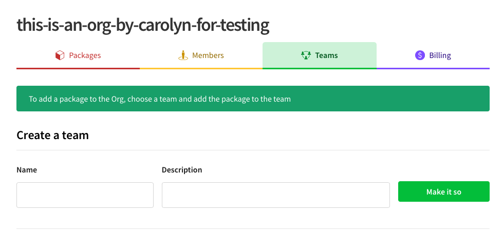
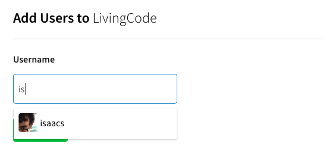
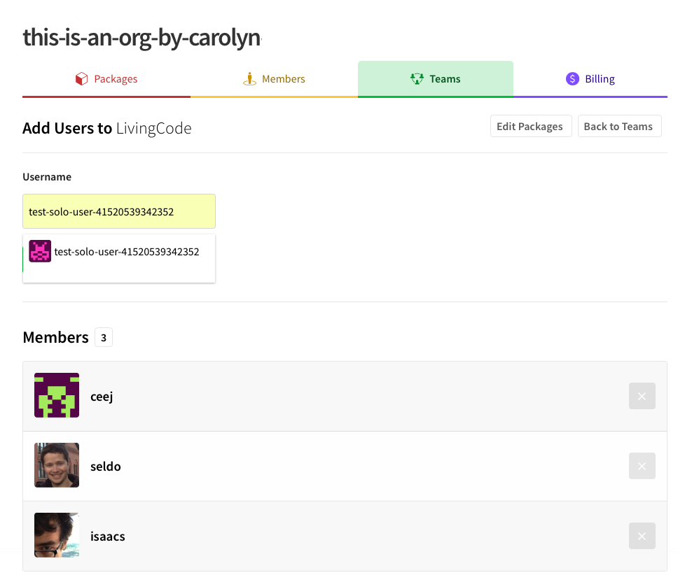

<!--
title: QA-ORGS-5 - Managing Teams
featured: true
-->

# Managing Teams

The key to managing package access in an Organization is teams.
**Teams are sets of Organization Members that have defined privileges
for a set of packages that are controlled by the Organization**.
This page will teach you how to create and manage the 
Membership of your Organization's team from the web interface.


## Managing Teams from the CLI

If you would like to manage the Membership of your team from
the npm command line interface (CLI), you can use:

```
npm team
```

Learn more about `npm team` [here][2].

If you are looking for how to manage a team's package access, check
out [this doc][1].

You will need to have the **Owner** or **Admin** role to perform this
work. For more information on **roles**, check out the 
[Roles and Privileges doc].

<hr/>

To manage your Organization's teams, navigate to your
Organization's landing page. You can find it at
`https://www.npmjs.com/org/<org_name>`.

Once you are on your Organization's landing page, click the "Teams" tab.
You can also just point your browser at 
`https://www.npmjs.com/org/<org_name>/teams`.

## Creating a Team


To create a team:

1. Click the "Create a Team" button.
2. Give your team a name. Your team name must be lower case and have no
  spaces or punctuation. Choose wisely! A team's name cannot be changed.
5. Click the "make it so" button.

<div style="text-align: center;"></div>


#### Notes

- Inviting an Organization Member to a new team does not send that user
  an email. Make sure to tell your new team Member that you added them.
- New teams do not have any package access by default. Once you create
  a team, you should add package access to the team. 
  ([Learn more about managing Package Access]).

## Managing Team Membership

To manage the membership of a team, navigate to your team's landing page.
You can find a list of your teams at `https://www.npmjs.com/org/<org_name>/teams`.

From this list, you can click the value in the "Members" column. 

- If the team has Members, this value will be the current Member count. Clicking
  this value will bring you to the Members tab for this team.
- If the team does not have any Members, this value will read "invite users".
  Clicking this value will bring you to the team Member invite page.

You can also navigate to your team page directly by pointing your browser at
`https://www.npmjs.com/org/<org_name>/teams/<team_name>`.

From there, click the "Members" tab. You'll use this interface to manage the
Membership of your team.

### Adding a Member to a Team

Add members. As you type a name, possible choices will appear in the drop-down.

<div style="text-align: center;"></div>

Click the Green `+Add-User` button when the username is complete.

The new member will be listed with others on the team page. 
<div style="text-align: center;"></div>

To add a Member to a team:

1. Enter the npm username of the user you would like to add to your team. A drop-down will appear.
2. Click the "add" button.
3. Repeat this until you have added all the Members you want.
4. When you are done, click a button or select a tab item to go on to your next task.

#### Notes

- Adding a Member to a team does not send them an email. Let
  your new team Member know that you added them to a team!
- You cannot add a user who is not a Member of your Organization to a team. If you need to add a user who is not a member, ask an Owner to invite them to the Organization so that you can add them to a team. ([Learn more about managing Members]).
- Organization Members cost $7/Member/month if the Organization has private packages, even if the teams the Member is a part of do not have access to private packages. 

### Removing a Member from a Team

To remove a Member from a team:

1. Locate the **Member** in the list of Members.
2. Hover over the X at the end of the row. It will turn red. Click the red X.

#### Notes

- Removing a Member from a team, even if it is the only team they are associated
  with, will **not** remove the Member from the Organization. If you would like to
  remove the Member from the Organization, you will need to be an Owner or ask
  an Owner. ([Learn more about managing Members]). 

[1]: managing-package-access.md
[Roles and Privileges doc]: roles-and-privileges.md
[Learn more about managing Package Access]: managing-package-access.md
[Learn more about managing Members]: managing-members.md
[2]: https://docs.npmjs.com/cli/team
