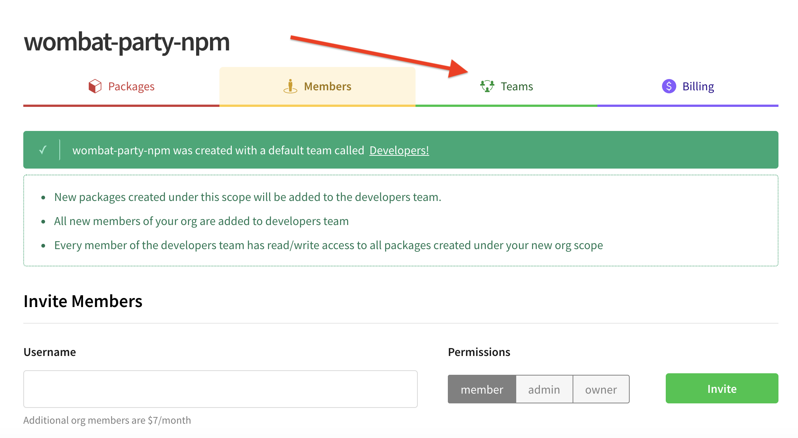
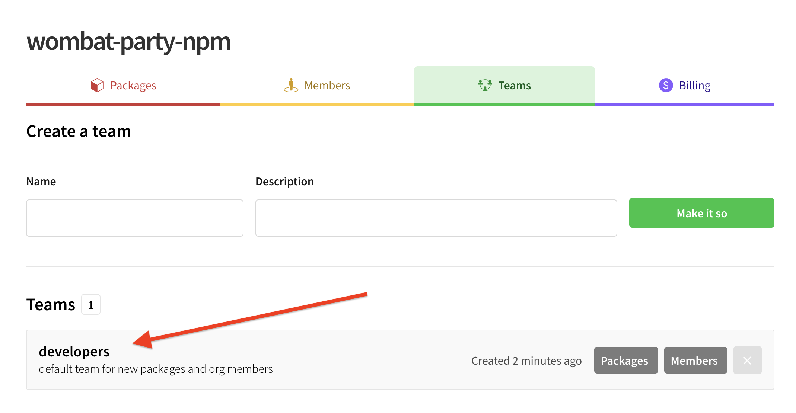

# The Developers Team

The **Developers Team** is a *special* team that is automatically
created when you create an Organization. This team is unique compared to other teams, because it has pre-built membership and package access defaults created for your convenience.his page will teach you about
the special properties of this team, as well as walk through what
happens when you delete this team and how to reinstate it.

Immediately after you create a new Org, the Org page appears.  Or, click Organizations from your home page:

`https://www.npmjs.com/~yourusername`

When you go to the Org page, you will see a tab for teams. (_Note: The screen shot shown is the one that appears after you create an Org. It is similar to the basic Org screen_).

Click the `Teams` tab to see all teams, including the developer team. Use the `Packages` or `Members` button to control the package and members in teams.

### Members

Members are automatically added to the Developers team:

- The user who created the Organization is added to this team automatically.
- Any Member added to the Organization is also added to this team automatically.

If an Owner adds a new Member to an Organization and **does not** want
that Member to be on the Developers team, an Owner can remove them.

Click the gray `Members` button to control members.

([Learn more about managing teams]).

### Package Access

**By default, the developers team has read/write access to all new packages
created under the Organization's scope.**

A nice side effect of this default is that the [`maintainers` field] in
the [`package.json`] of any newly created packages under the Organization scope
is automatically populated with the Members of the current Developers team.

If you create a new package under your Organization's scope and you do not
want Members of the Developers team to have read/write access to that
package, an Owner or Admin can remove the Developers team's access to that
package. ([Learn more about managing package access]).

## Removing the Developers Team

An Owner or an Admin can delete the Developers team. If the Developers team
is deleted:

- Newly added Members of the Organization will not be automatically added to
  any team.
- Any package access that current Members had because they were a Member of
  the Developers team will be removed.
- npm will attempt to fill the [`maintainers` field] in [`package.json`] of
  any newly created packages under the Organization scope with the Members of
  a team the publishing user is a Member of. This behavior is not predictable.

## Reinstating the Developers Team

An Owner or Admin can "reinstate" the Developers team by creating a new team
with the name "developers". This "new" Developers team will have all the
default behavior of the original Developers team:

- All Members added to the Organization after the Developers team is
  reinstated will be automatically added to the Developers team.
- All Members of the Developers team will automatically have read/write access
  to all new packages created under the Organization scope.

You **will** need to manually add any Members of the Organization that existed
before the Developers team was "reinstated" if you'd like them to also
experience the special Developers team defaults.

# Quick Links

These links will take you to the developer team pages. Replace _your-org-name_ with the appropriate Org name.

_Quick link to see all teams:_

`https://www.npmjs.com/settings/your-org-name/teams`

_Quick link for Viewing/Adding Org Team Members:_

`https://www.npmjs.com/settings/your-org-name/teams/team/developers/users`

_Quick link for Viewing/Adding Packages:_

`https://www.npmjs.com/settings/your-org-name/teams/team/developers/access`

([Learn more about managing teams]).

[Learn more about managing teams]: managing-teams.md
[Learn more about managing Package Access]: managing-package-access.md
[`maintainers` field]: https://docs.npmjs.com/files/package.json#people-fields-author-contributors
[`package.json`]: https://docs.npmjs.com/files/package.json
